# Enterprise AI Operations Agent  
 An internal AI copilot that removes operational bottlenecks and replaces people-dependent workflows

This system is designed for founders and leadership teams who are scaling AI-powered workflows and need reliability, control, and decision velocity — without adding operational complexity or headcount.

# 🛠️ The Tech Stack

Orchestration: n8n (Production-grade workflow automation)

LLM Framework: CrewAI (Multi-agent orchestration)

Backend: Python 3.12 (Pydantic V2 for strict type safety)

Infrastructure: AWS ECS Fargate, Secrets Manager, IAM (Least-Privilege)

Vector Store: PostgreSQL + pgvector for bounded context retrieval

Observability: Langfuse (Traceability, Latency, and Cost tracking)

# The Business Problem This Solves

As companies scale, operational knowledge fragments across tools, documents, and people.

The result:
- Founders become decision bottlenecks
- Teams rely on tribal knowledge
- AI systems behave unpredictably in production
- Costs, failures, and risks surface too late

Most AI initiatives fail not because models are weak — but because **operations lack control, observability, and decision boundaries**.

## Who This Is For

This system is designed for:

- Founders and executive teams scaling AI-powered operations
- SaaS and software companies running AI in production
- Teams where AI decisions impact customers, revenue, or risk
- Organizations that need AI systems to be dependable, auditable, and controllable

This is especially relevant when AI systems are no longer experimental — but operationally critical.

## When to Use This

Use this system when:

- AI workflows directly affect customers or revenue
- Failure modes must be detected before they cause damage
- Cost, latency, and quality need active governance
- Human oversight is required for high-risk decisions
- Leadership needs confidence in how AI behaves in production

---

## Problem Statement

Modern enterprises deploy LLM-powered systems without sufficient controls
for response quality, cost, failure handling, and auditability.

This repository demonstrates how to design and operate an agentic AI system
that is safe, observable, and suitable for real business workflows.

---

## What This System Does

- This system acts as an operational control plane for AI workflows in production.
- Orchestrates multi-agent LLM workflows
- Retrieves and bounds high-signal context
- Evaluates responses before execution
- Routes tasks across LLM providers
- Escalates low-confidence cases to humans
- Logs decisions for audit and analysis

---

## What This System Intentionally Does NOT Do

- No user-facing UI
- No fine-tuning
- No autonomous self-modifying agents
- No multi-cloud abstraction
- No unnecessary framework complexity

These exclusions are deliberate design choices.

---

## Example Business Use Case

AI-Powered Customer Support (Production Scenario)

Incoming support requests are processed through a governed agentic pipeline that:

1. Retrieves only high-signal, bounded knowledge
2. Generates a response within defined quality thresholds
3. Evaluates confidence, risk, and cost
4. Automatically responds or escalates to a human

This ensures AI assistance improves efficiency **without introducing uncontrolled risk**.

---

## Architecture Overview

 **Core Components**
- Workflow orchestration: n8n
- Agent framework: CrewAI
- Runtime: AWS ECS (Fargate)
- Storage: PostgreSQL + pgvector, S3
- Observability: Langfuse, CloudWatch
- Notifications: Slack

```mermaid
graph TD
    %% Define Nodes
    subgraph "External Triggers"
        Webhook["n8n Webhook"]
        Slack["Slack Event"]
    end

    subgraph "The Control Plane (AWS Fargate)"
        Orc["🧠 Orchestrator Agent"]
        Eval["⚖️ Evaluation Agent"]
        Auth{"🔐 Policy Check"}
    end

    subgraph "The Action Layer"
        Ret["🔍 Retrieval Agent"]
        Action["🛠️ Action Agent"]
    end

    subgraph "Storage & Monitoring"
        DB[("🛢️ PostgreSQL / pgvector")]
        Obs["📊 Langfuse Observability"]
    end

    %% Flow logic
    Webhook --> Orc
    Slack --> Orc
    Orc --> Auth
    Auth -->|"Approved"| Ret
    Ret --> DB
    DB --> Orc
    Orc --> Eval
    Eval -->|"Confidence > 0.85"| Action
    Eval -->|"Low Confidence"| Slack
    Action --> Obs
```

---

## Agent Responsibilities

- **Orchestrator Agent**  
  Controls execution flow and enforces policies

- **Retrieval Agent**  
  Fetches and bounds relevant context

- **Evaluation Agent**  
  Scores responses and determines approval or escalation

- **Action Agent**  
  Executes approved actions only

---

## Reliability & Governance

## 🛡️ Reliability & Hallucination Prevention

In a production environment, "vibe-checking" is not a strategy. This system treats AI reliability as a core engineering constraint, implementing a **Multi-Layer Deterministic Safety Protocol** to eliminate hallucinations and ensure grounded responses.

### **1. Retrieval Bounding (The "Box" Strategy)**
To prevent the LLM from "imagining" facts, we use **Restricted Context Injection**:
* **Vector-Only Grounding:** The Retrieval Agent is strictly prohibited from using its internal training data for factual claims. It must cite specific metadata IDs from our `pgvector` store.
* **Threshold Filtering:** We implement a cosine similarity floor. If no document meets a 0.82 relevance score, the system triggers an "Insufficient Knowledge" exception rather than attempting a guess.

### **2. Structural Integrity (Pydantic V2 Guardrails)**
We eliminate "Prose Hallucinations" (where the AI ignores instructions) by enforcing strict schema validation:
* **Deterministic Output:** Every agent response is parsed through a Pydantic model. If the JSON structure is invalid or missing required fields (e.g., `confidence_score`, `source_citations`), the Orchestrator executes a recursive self-correction loop.
* **Type Safety:** We enforce strict data types for all tool arguments to prevent the model from hallucinating non-existent API parameters.

### **3. The "Conscience" Layer (Dual-Agent Evaluation)**
Before any action is executed, the **Evaluation Agent** performs a "Groundedness Audit":
* **NLI (Natural Language Inference):** The system checks if the proposed response is logically entailed by the retrieved context.
* **Confidence Scoring:** We use a customized rubric to score the response. 
    * **Score > 0.85:** Automated Execution.
    * **Score 0.70 - 0.85:** Routed for secondary verification.
    * **Score < 0.70:** Immediate escalation to the **Human-in-the-Loop (HITL)** via Slack.

### **4. Cost & Latency Governance**
Reliability also means fiscal predictability.
* **Model Routing:** We use a "Small-to-Large" routing logic. Low-risk tasks are handled by faster, cost-effective models (e.g., Claude Haiku), while high-stakes reasoning is reserved for frontier models (e.g., GPT-4o), ensuring we hit ROI targets without compromising quality.
* **Observability:** Every decision is traced via **Langfuse**, providing a full audit trail of the "Chain of Thought" for compliance and post-mortem analysis.
---

## Deployment Model

- Containerized service running on AWS ECS (Fargate)
- Secrets managed via AWS Secrets Manager
- IAM roles follow least-privilege principles
- Event-driven triggers via n8n webhooks

Infrastructure definitions are located in `infra/`.

This deployment model reflects real-world production environments used by scaling teams.

---

## Project Status

Status: 🚀 Production-Ready (v1.0)

CI/CD: GitHub Actions enabled for automated testing.

Security: PII-scrubbing middleware included in the Retrieval Layer.

Scalability: Stateless architecture ready for AWS Fargate horizontal scaling.

---

## Why This Project Exists

This repository is intentionally designed to reflect how senior engineers
build and operate AI systems in production environments.

It favors correctness, governance, and clarity over novelty.

